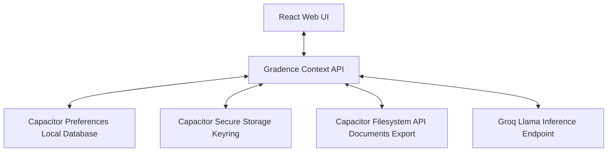

# Gradence

An offline-first academic operating workspace for structured progress tracking, planning, and performance management.

---

## 1. Positioning

Gradence is a local-first desktop and mobile academic workspace that centralizes grade tracking, attendance metrics, lecture schedules, habit loops, and career planning into a single private database. It replaces fragmented, cloud-dependent consumer utilities with a cohesive, offline workspace designed for long-term academic growth.

---

## 2. The Problem

Students manage their academic performance using a fragmented assortment of single-purpose utilities:
* **GPA calculations** are run on ad-hoc web calculators.
* **Attendance tracking** is kept in basic mobile checklists.
* **Lectures and timetables** are written in generic calendar interfaces.
* **Revision plans and task countdowns** are spread across sticky notes and notes apps.

This structural fragmentation introduces significant friction. Because these tools do not share state, students cannot see the downstream impact of their daily choices. An absent lecture does not update the student's attendance safety margin, and a drop in semester attendance does not warn them about their target graduation GPA. This lack of integration leads to inconsistent records, stale calculations, and unnecessary academic anxiety.

---

## 3. Why Gradence Exists

Gradence was born out of frustration with modern student productivity software. Most current applications are built around advertising models, cloud lock-in, and constant notification loops. They treat students as targets for monetization rather than developers of their own careers.

We believe that tracking your academic journey should not require giving up ownership of your data or relying on third-party servers. Gradence is built as an offline-first companion that sits directly on your device. It provides a clean, distraction-free environment that helps you focus on what matters: consistent effort, clear milestones, and systematic academic improvement.

---

## 4. What Makes Gradence Different

* **Offline-First Architecture**: Your academic history is written directly to your device storage. Gradence does not require network access for its core functions, ensuring instant load times and complete privacy.
* **Data Portability and Security**: We use Capacitor Preferences and Secure Storage. Sensitive data, like LLM API credentials, are stored in hardware keystores. You can export your entire database as a standard JSON backup file at any time.
* **State Cohesion**: Features are not isolated. Daily habits, timetables, and countdowns share a central React Context state layer. Toggling a habit or log in one view immediately updates your metrics across the entire workspace.
* **Privacy-First Model**: Gradence does not require user accounts, email registration, or cloud syncing. Your data remains in your control.

---

## 5. Core Features

### GPA & CGPA Tracking
* **The Outcome**: Gain a clear, visual understanding of your historical and projected academic standing.
* **Why It Matters**: Standard tools calculate GPAs in isolation. Gradence archives your course credits, grade points, and semester history into a central database.
* **The Benefit**: Instantly view your cumulative GPA trends across semesters and project future performance using the built-in target estimator.

### Attendance Management
* **The Outcome**: Avoid academic penalties with predictive attendance forecasting.
* **Why It Matters**: Tracking hours is not enough; you need to know your margin of safety.
* **The Benefit**: The system alerts you to your current attendance status and calculates exactly how many upcoming lectures you can safely skip (or must attend) to maintain your target threshold.

### Semester Planning
* **The Outcome**: Establish structured targets before the semester begins.
* **Why It Matters**: A successful semester requires balancing credit loads and target outcomes early.
* **The Benefit**: Log expected credit distributions and set realistic target SGPAs to guide your daily study targets.

### Timetable Management
* **The Outcome**: A unified dashboard view of your active daily commitments.
* **Why It Matters**: Class times and locations should be integrated with your academic tracker, not hidden in separate calendar tools.
* **The Benefit**: A simple local scheduler that updates your main home dashboard with chronological, location-aware lecture lists.

### Exam Tracking
* **The Outcome**: Maintain a priority-sorted calendar of upcoming academic assessments.
* **Why It Matters**: Not all exams carry the same weight or urgency.
* **The Benefit**: Log tests with custom target dates and priority levels to see remaining preparation days directly on your home dashboard.

### Habit Tracking
* **The Outcome**: Build consistent daily routines that support your academic goals.
* **Why It Matters**: High grades are the result of consistent daily habits.
* **The Benefit**: Log daily actions (e.g., coding, reading, reviewing) right from the dashboard to track your completion streaks.

### Countdown Management
* **The Outcome**: Maintain awareness of major project deadlines.
* **Why It Matters**: Important milestones can get lost in daily tasks.
* **The Benefit**: Dynamic countdown timers display the days remaining for key milestones on your homepage.

### Academic Progress Monitoring
* **The Outcome**: View your academic progress in a clean visual summary.
* **Why It Matters**: Visualizing your progress helps maintain momentum.
* **The Benefit**: Comprehensive analytics charts map your GPA progression and average subject attendance to help you identify trends.

### Backup & Restore
* **The Outcome**: Complete ownership and portability of your academic data.
* **Why It Matters**: You should never lose your records due to device changes or application updates.
* **The Benefit**: Export your entire database to a physical JSON file in your Documents folder using the native Filesystem API, or copy it to your clipboard for easy transfer.

### AI-Powered Academic Assistance
* **The Outcome**: Generate customized learning roadmaps for your career goals.
* **Why It Matters**: Translating academic classes into industry skills can be challenging.
* **The Benefit**: Query the local Groq Llama interface using your own API key to generate stage-by-stage learning plans. You can follow these roadmaps and track your progress in the Roadmaps Manager.

---

## 6. Architecture Highlights

* **Local Storage Layer**: We use Capacitor Preferences to store all structured tables as localized offline JSON records.
* **Keystore Encryption**: Groq API credentials are stored in secure native hardware containers (Android Keystore / iOS Keychain) using `@aparajita/capacitor-secure-storage`.
* **Zero Cloud Dependence**: We disable unencrypted auto-backups (`android:allowBackup="false"`) to prevent data leakage and ensure that uninstalls completely wipe all local cached credentials.
* **Portability**: All data imports validate JSON schemas using type guards to prevent application crashes from malformed inputs.

---

## 7. Who Gradence Is For

Gradence is built for students who:
* Want a single, organized place to manage their academic life.
* Value data privacy and want to keep their records off third-party servers.
* Need structured tools to track long-term academic progress and career preparation.
* Prefer clean, ad-free utilities over busy consumer applications.

---

## 8. Product Philosophy

Gradence is designed to be a personal academic workspace. It focuses on:
* **Progress over Perfection**: Tracking your journey is about understanding trends and making steady improvements over time.
* **Actionable Metrics**: We prioritize useful calculations (like attendance safety margins and target GPA projections) over static lists.
* **Long-Term Growth**: We help you connect daily study habits, class attendance, and exam prep to your long-term career goals.

---

## 9. Interface Preview

*(Screenshots showing the Home Dashboard, CGPA Calculator, and AI Career Roadmaps will be updated here)*

---

## 10. Installation

Detailed setup, installation, and update guidelines are documented in our [Installation Guide](docs/installation.md).

### Sideloading the Android Package:
1. Download the latest `Gradence-<version>.apk` from our [GitHub Releases Page](https://github.com/Yugenjr/Gradence/releases).
2. Open the `.apk` file on your Android device.
3. Allow installation from unknown sources in your browser or file manager settings.
4. Tap **Install** to complete the setup.

---

## 11. Tech Stack

* **Frontend**: React 19, Vite, Tailwind CSS, Lucide icons, Framer Motion
* **Native Runtime**: Capacitor Android (with native Preferences, Filesystem, and Secure Storage plugins)
* **API Integration**: Groq Cloud SDK (Llama inference)
* **Build System**: Gradle (for Android compilation)

---

## 12. Roadmap

* [x] Migrate all local storage keys to Capacitor Preferences.
* [x] Implement secure native hardware encryption for API credentials.
* [x] Design a Single Source of Truth architecture for all features.
* [x] Implement local JSON backup exports using the Capacitor Filesystem.
* [ ] Add offline SQLite database support for larger academic records.
* [ ] Implement local PDF report generation for academic summaries.
* [ ] Create widget integrations for Android home screens.

---

## 13. Future Vision

Our goal is to build Gradence into a complete, private digital workspace for students. Future updates will focus on local machine learning features, offline study tools, and deeper integrations to help students transition smoothly from university to their professional careers—all while maintaining complete data ownership.

---

## 14. Contribution Guide

We welcome contributions to Gradence! Please read our [Contributing Guidelines](CONTRIBUTING.md) to learn about our coding standards, branch naming conventions, and pull request workflows.
